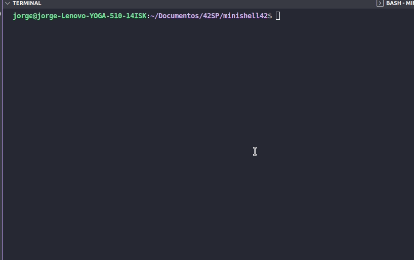
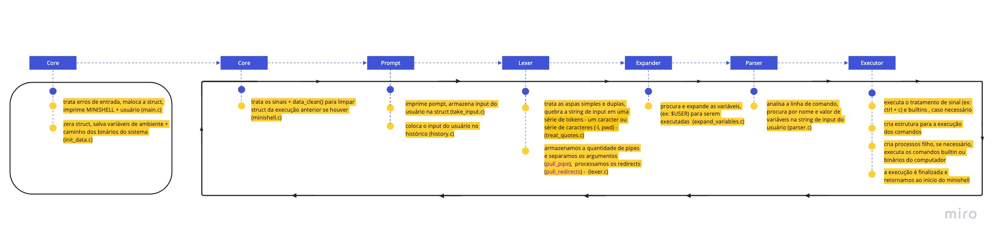

# minishell

Making your own Linux Shell in C.
The shell is the linux command line prompt, which receives the commands typed by the user and executes them.

A shell does three main things in your life:

- **Initialize**: In this step, a typical shell would read and execute its configuration files. This changes aspects of shell behavior;
- **Interpret**: Then the shell reads commands from stdin (which can be interactive or a file) and executes them;
- **Terminate**: After your commands are executed, the shell executes any shutdown commands, frees up any memory and terminates;
---------------------------------------------------------------------------------------------
Fazendo seu próprio Linux Shell em C.
O shell é  o “prompt” da linha de comando do linux, que recebe os comandos digitados pelo usuários e os executa

Um shell faz três coisas principais em sua vida:

- **Initialize**: Nesta etapa, um shell típico leria e executaria seus arquivos de configuração. Isso altera aspectos do comportamento do shell;
- **Interpret**: Em seguida, o shell lê comandos de stdin(que pode ser interativo ou um arquivo) e os executa;
- **Terminate**: Depois que seus comandos são executados, o shell executa qualquer comandos de desligamento, libera qualquer memória e termina;
## Skills
- Unix
- Imperative programming
- Rigor
- Algorithms & AI 

## Demo


## My grade


## Flowchat:



🚧 project:<br/>
```
# Compile the program with
make

# Run the program
./minishell

# Write any shell command like
echo "hello world"

# Quit the program
exit

# Clean output objects with
make fclean

:shower: Clean Obj files:<br/>
```
minishell $ make clean
```
:shower: :shower: Clean All (obj files + binary):<br/>
```
minishell $ make fclean
```
:shower: :shower: 🚧 Clean All + build:<br/>
```
minishell $ make re
```

<br/>See Makefile<br/>

### Made with: <br/>
### Jorge Alves
<div style="display: inline_block">
 <a href="https://github.com/jorgeedualves/jorgeedualves" target="_blank"></a>
 <a href="https://www.linkedin.com/in/jorge-eduardo-alves-094b4331/" target="_blank"></a> 
</div>

### Alfredo Neto
<div style="display: inline_block">
 <a href="https://github.com/Alfredo-Neto" target="_blank"></a>
 <a href="https://www.linkedin.com/in/alfredo-neto-a2515814b/" target="_blank"></a> 
</div>

### Alexandre Zamarion
<div style="display: inline_block">
 <a href="https://github.com/alezamarion" target="_blank"></a>
 <a href="https://www.linkedin.com/in/alexandre-zamarion-cepeda-a3766323a/" target="_blank"></a> 
</div>
